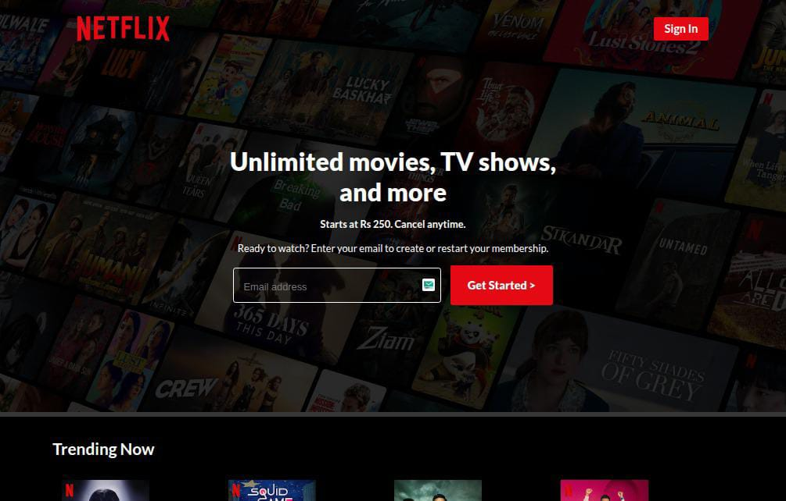
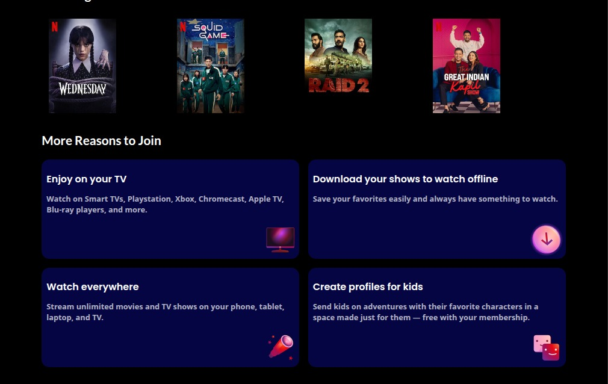
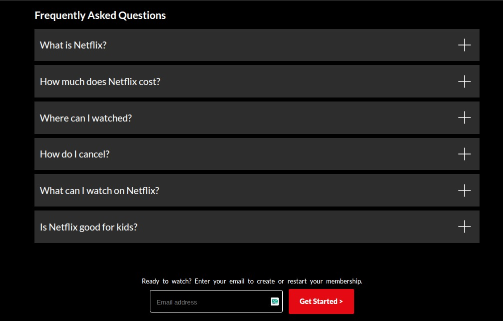
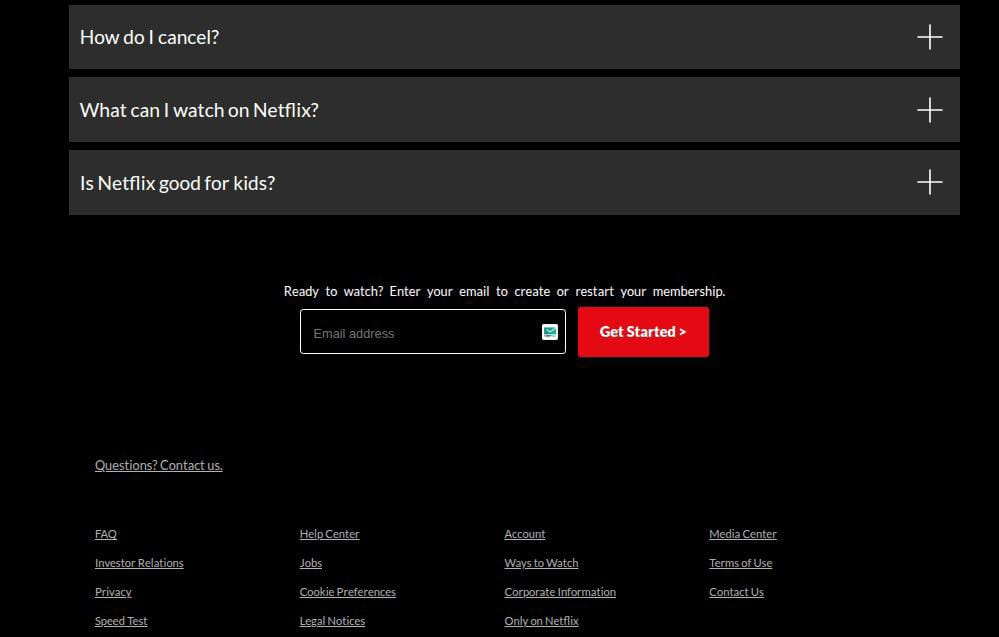

# 🎬 Netflix Clone

A simple **Netflix homepage clone** created using **HTML & CSS**.  
This project focuses on building responsive layouts and practicing modern UI design.

---

## 🚀 Features
- Netflix-style homepage layout  
- Responsive design (works on mobile, tablet, desktop)  
- Clean, modern UI built with pure HTML & CSS  
- Practice for flexbox, grid, and positioning  

---

## 🧠 What I Learned
- Structuring web pages using semantic HTML  
- Styling complex layouts with CSS Flexbox & Grid  
- Creating responsive designs using media queries  

---

## 🖼️ Preview





---

## 🛠️ Technologies Used
- HTML5  
- CSS3  

---

## 📂 How to Use
1. Clone this repository  
   ```bash
   git clone https://github.com/kumailzs/Netflix-Clone.git

Open index.html in your browser


👨‍💻 Author

Kumail Raza
📧 Connect with me on GitHub
